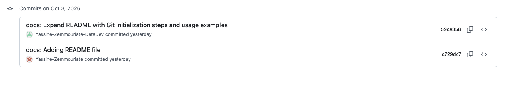

# Mon Projet

## Git . Partie A: Initialisation et premier commit
1) J'initialise und dépôt git avec la commande `git init`.
2) En vérifiant l'état du dépôt avec la commande `git status`, ça m'affiche ça:

```bash
On branch main

No commits yet

nothing to commit (create/copy files and use "git add" to track)
```

4) J'ajoute le fichier `README.md` à la zone de staging avec la commande `git add README.md`.
5) Je remarque qu'avant le mettre à la zone de staging, il apparaît en rouge
```bash
On branch main

No commits yet

Untracked files:
  (use "git add <file>..." to include in what will be committed)
        README.md

nothing added to commit but untracked files present (use "git add" to track)
```
Puis après le fichier se met en vert
```bash
On branch main

No commits yet

Changes to be committed:
  (use "git rm --cached <file>..." to unstage)
        new file:   README.md
```

6) Je fais un premier commit en respectant les Conventional Commit Messages avec la commande `git commit -m "docs: Adding README file"`.
Ça me renvoie :
```bash
[main (root-commit) c729dc7] docs: Adding README file
 1 file changed, 30 insertions(+)
 create mode 100644 README.md 
```

7) J'affiche l'historique des commit avec la commande `git log --oneline`, le flag `--online`c'est pour afficher les commits sur une seule ligne.
8) Je configure mon identité Git avec la commande `git config --global user.name "Yassine-Zemmouriate-DataDev"`, puis `git config --global user.email "zemmouriateyassine@gmail.com"`.
- Git me demande de configurer mon identité Git parce que c'est une bonne pratique pour que les autres puissent identifier qui a fait les modifications.

## Git . Partie B: Branches, historique et conflits
9) Je crée une branche avec la commande `git checkout -b feature-login`.
10) J'affiche la différence en utilisant la commande `git diff`.
12) Je reviens à la branche main avec la commande `git checkout main`.
13) je fusionne la branche feature-login avec la branche main avec la commande `git merge feature-login`.
J'ai ce retour:
```bash
 yassinezemmouriate@macbook-air mon-projet-git % git merge feature-login
Updating c729dc7..59ce358
Fast-forward
 README.md | 25 ++++++++++++++++++++++++-
 1 file changed, 24 insertions(+), 1 deletion(-)
```
14) Je crée le fichier `.gitignore` avec les lignes suivantes:
```gitignore
.env
node_modules/
```
15) Si deux branches modifient la même ligne d'un même ficiher avant le merge, Git me demande de résoudre le conflit manuellement en modifiant le fichier concerné et en ajoutant les modifications.
    - Un conflit de merge est déclenché quand Git ne sait pas quelle modification conserver

## GitHub . Partie A: Dépôt distant : push and pull
17) Je lie mon dépôt local au dépôt distant sur GitHub avec la commande `git remote add origin https://github.com/Yassine-Zemmouriate-DataDev/mon-projet-git.git`.

18) Je push mes modifications sur GitHub avec la commande `git push origin main`.
19) 

